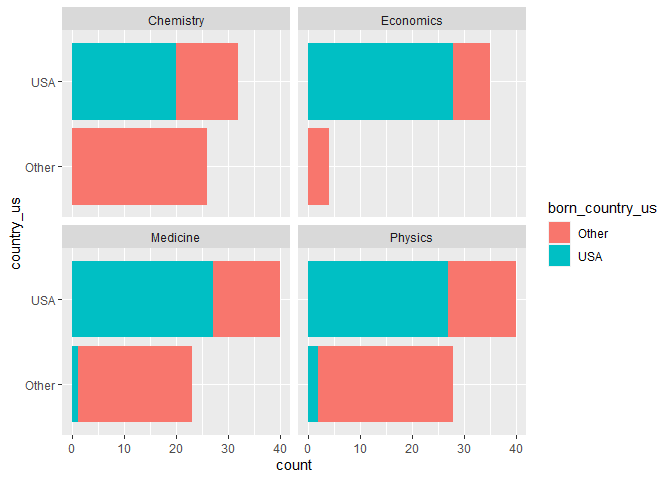

Lab 03 - Nobel laureates
================
Adam Paul
2/11

### Load packages and data

``` r
library(tidyverse) 
```

``` r
nobel <- read_csv("data/nobel.csv")
```

# Exercises

## Exercise 1

### Question 1

How many observations and how many variables are in the dataset? Use
inline code to answer this question. What does each row represent?

``` r
view(nobel)
```

935 observations of 26 variables. Each row represents an individual
nobel laureate.

### Question 2

Create a new data frame called nobel\_living that filters for:

1.  Laureates for whom country is available

2.  Laureates who are people as opposed to organizations (organizations
    are denoted with “org” as their gender)

3.  Laureates who are still alive (their died\_date is NA)

``` r
nobel_living <- nobel %>% #Is creating the new data frame out of nobel
  filter(!is.na(country), #Is opening filter, and beginning by filtering for ones where country is not NA
  gender != "org",        #Is filtering for ones where gender is not (! meaning not) equal to org
  is.na(died_date))       #Is filtering for ones that do not have a death date
view(nobel_living)
```

## Exercise 2

### Set-up

Rather than write up my own explanation, here is the one offered by
Mason for this set-up portion.

First, we’ll create a new variable to identify whether the laureate was
in the US when they won their prize. We’ll use the `mutate()` function
for this. The following pipeline mutates the `nobel_living` data frame
by adding a new variable called `country_us`. We use an if statement to
create this variable. The first argument in the `if_else()` function
we’re using to write this if statement is the condition we’re testing
for. If country is equal to `"USA"`, we set country\_us to `"USA"`. If
not, we set the country\_us to `"Other"`.

> Note: I do want it known that in my desire to make things look good I
> both looked up how to replicate making the variable names appear in
> boxes, *and* the text formatting used here. And by looked up, I mean I
> went into the .rmd for the assignment instructions. If only I I could
> dedicate a fraction of that neuroticism towards anything else.

``` r
nobel_living <- nobel_living %>% #This is saying to create a change in nobel_living, modeled off of the same data frame
  mutate(
    country_us = if_else(country == "USA", "USA", "Other")
  )
```

Next, we will limit our analysis to only the following categories:
Physics, Medicine, Chemistry, and Economics.

``` r
nobel_living_science <- nobel_living %>%
  filter(category %in% c("Physics", "Medicine", "Chemistry", "Economics"))
```

Create a faceted bar plot visualizing the relationship between the
category of prize and whether the laureate was in the US when they won
the nobel prize. Interpret your visualization, and say a few words about
whether the Buzzfeed headline is supported by the data.

1.  Your visualization should be faceted by category.

2.  For each facet you should have two bars, one for winners in the US
    and one for Other.

3.  Flip the coordinates so the bars are horizontal, not vertical.

``` r
ggplot(nobel_living_science, aes(y= country_us)) + #Alternatively to graphing it to y, coord_flip() would also work
  geom_bar() +
  facet_wrap(~ category)
```

<!-- -->

Looking at the graph, it is the case that *more* nobel laureates lived
in the U.S. compared to all other countries combined, I would not say
it’s accurate to say that **most** lived there. With the notable
exception of economics, which as you pointed out, is a bit different
from the science Nobel Prizes.

## Exercise 3

### Question 4

Create a new variable called `born_country_us` that has the value
`"USA"` if the laureate is born in the US, and `"Other"` otherwise. How
many of the winners are born in the US?

``` r
nobel_living_science <- nobel_living_science %>% #Wholesale stealing from earlier code, as one should.
  mutate(
    born_country_us = if_else(born_country == "USA", "USA", "Other"))
nobel_living_science %>%
  filter(born_country_us == "USA")
```

    ## # A tibble: 105 x 28
    ##       id firstname  surname  year category affiliation  city  country born_date 
    ##    <dbl> <chr>      <chr>   <dbl> <chr>    <chr>        <chr> <chr>   <date>    
    ##  1    95 Leon N.    Cooper   1972 Physics  Brown Unive~ Prov~ USA     1930-02-28
    ##  2   103 Ben R.     Mottel~  1975 Physics  Nordita      Cope~ Denmark 1926-07-09
    ##  3   106 Samuel C.~ Ting     1976 Physics  Massachuset~ Camb~ USA     1936-01-27
    ##  4   107 Philip W.  Anders~  1977 Physics  Bell Teleph~ Murr~ USA     1923-12-13
    ##  5   112 Robert Wo~ Wilson   1978 Physics  Bell Labora~ Holm~ USA     1936-01-10
    ##  6   113 Sheldon    Glashow  1979 Physics  Harvard Uni~ Camb~ USA     1932-12-05
    ##  7   115 Steven     Weinbe~  1979 Physics  Harvard Uni~ Camb~ USA     1933-05-03
    ##  8   138 Jerome I.  Friedm~  1990 Physics  Massachuset~ Camb~ USA     1930-03-28
    ##  9   143 Russell A. Hulse    1993 Physics  Princeton U~ Prin~ USA     1950-11-28
    ## 10   144 Joseph H.  Taylor~  1993 Physics  Princeton U~ Prin~ USA     1941-03-29
    ## # ... with 95 more rows, and 19 more variables: died_date <date>, gender <chr>,
    ## #   born_city <chr>, born_country <chr>, born_country_code <chr>,
    ## #   died_city <chr>, died_country <chr>, died_country_code <chr>,
    ## #   overall_motivation <chr>, share <dbl>, motivation <chr>,
    ## #   born_country_original <chr>, born_city_original <chr>,
    ## #   died_country_original <chr>, died_city_original <chr>, city_original <chr>,
    ## #   country_original <chr>, country_us <chr>, born_country_us <chr>

105 winners were born in the USA.

### Question 5

Add a second variable to your visualization from Exercise 3 based on
whether the laureate was born in the US or not. Based on your
visualization, do the data appear to support Buzzfeed’s claim? Explain
your reasoning in 1-2 sentences.

1.  Your final visualization should contain a facet for each category.
2.  Within each facet, there should be a bar for whether the laureate
    won the award in the US or not.
3.  Each bar should have segments for whether the laureate was born in
    the US or not.

``` r
ggplot(nobel_living_science, aes(y= country_us,
                                 fill = born_country_us)) +
  geom_bar() +
  facet_wrap(~ category)
```

<!-- -->

The data shows that most U.S. based nobel laureates were born in the
U.S. More accurately, one could say that far more Nobel laureates move
to the U.S. from another country than from the U.S. to another country.
But most U.S. laureates were born in the U.S.

## Exercise 4

### Question 6

In a single pipeline, filter for laureates who won their prize in the
US, but were born outside of the US, and then create a frequency table
(with the `count()` function) for their birth country (`born_country`)
and arrange the resulting data frame in descending order of number of
observations for each country. Which country is the most common?

``` r
nobel_living_science %>%  #What tibble we want
  filter(country_us == "USA", born_country_us == "Other") %>% #Filtering for people who won in US but were born elsewhere
  count(born_country) %>% #Table of different countries
  arrange(desc(n)) #ARRANGEd by DESCending order of n (of born_country)
```

    ## # A tibble: 21 x 2
    ##    born_country       n
    ##    <chr>          <int>
    ##  1 Germany            7
    ##  2 United Kingdom     7
    ##  3 China              5
    ##  4 Canada             4
    ##  5 Japan              3
    ##  6 Australia          2
    ##  7 Israel             2
    ##  8 Norway             2
    ##  9 Austria            1
    ## 10 Finland            1
    ## # ... with 11 more rows

There were seven (7) immigrants from Germany and the United Kingdom, who
tied for the most.
